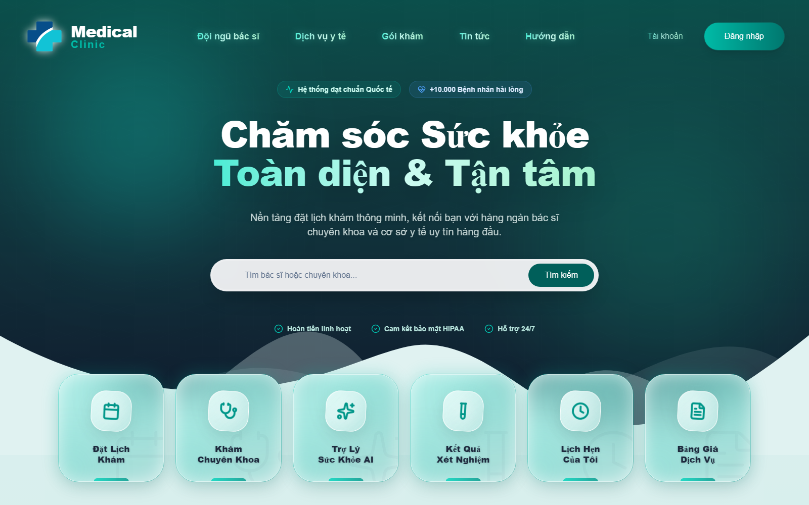
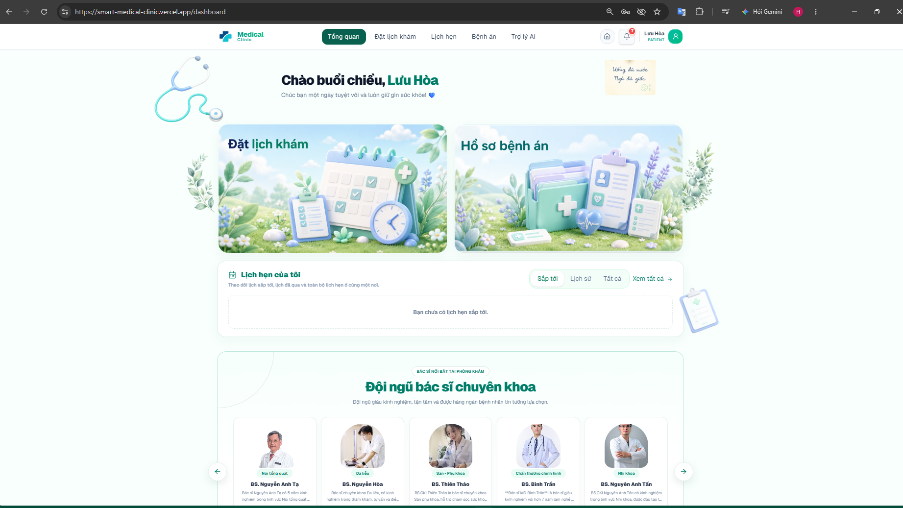
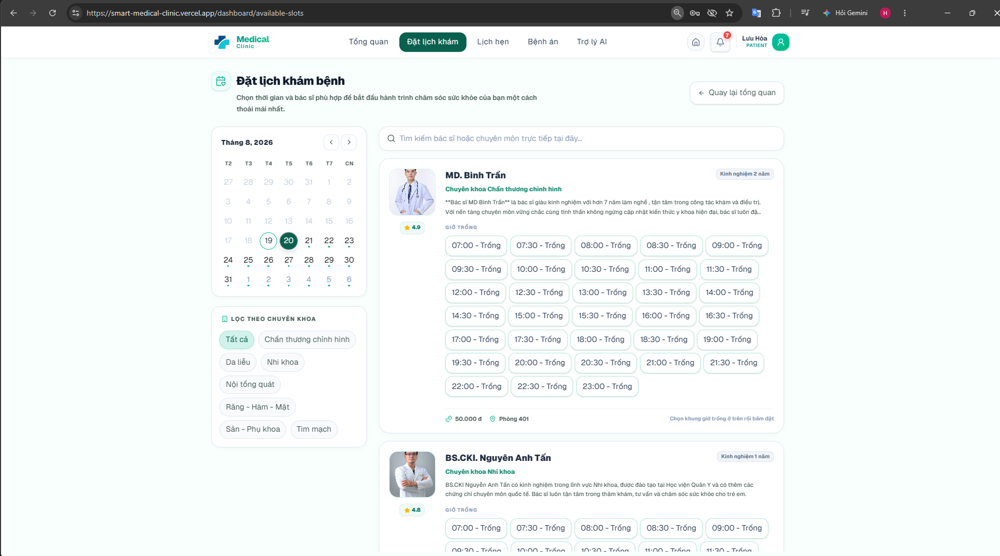
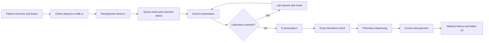
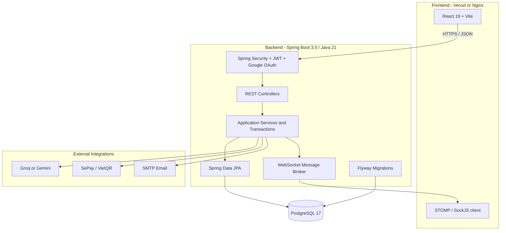

<div align="center">

# Smart Medical Clinic

### AI-assisted, end-to-end clinic operations platform

From online appointment booking and patient reception to clinical examination,
laboratory results, e-prescriptions, pharmacy inventory, payments, refunds, and
operational reporting.

[](https://smart-medical-clinic.vercel.app)
[](backend/pom.xml)
[](backend/pom.xml)
[](frontend/package.json)
[](docker-compose.yml)
[](docker-compose.yml)
[](backend/src/test)

**[Explore the live product](https://smart-medical-clinic.vercel.app)** ·
**[Architecture](docs/architecture.md)** ·
**[Run locally](#getting-started)**

</div>



> Smart Medical Clinic is a university capstone project designed as a real,
> deployable product for small and medium-sized clinics. The system connects six
> operational roles through a single clinical and financial workflow.

## Product Tour

<table>
  <tr>
    <td width="50%" valign="top">
      
      <br />
      <strong>Patient command center</strong><br />
      A personalized dashboard brings appointments, medical records, care actions,
      notifications, and specialist discovery into one calm, accessible workspace.
    </td>
    <td width="50%" valign="top">
      
      <br />
      <strong>Doctor and time-slot booking</strong><br />
      Patients can filter by specialty, compare clinicians, inspect live availability,
      and select an appointment slot without leaving the scheduling workflow.
    </td>
  </tr>
</table>

## Why This Project Stands Out

| Capability | Engineering value |
| --- | --- |
| **Complete clinic workflow** | Covers booking, reception, queueing, examination, laboratory work, prescriptions, dispensing, billing, and follow-up instead of implementing isolated CRUD screens. |
| **Six-role access model** | Patient, doctor, receptionist, pharmacist, laboratory technician, and administrator experiences are protected with JWT authentication and method-level RBAC. |
| **AI-assisted care navigation** | Groq or Gemini can classify patient symptoms, recommend an appropriate specialty, and normalize free-form clinical notes into structured medical data. |
| **Medication safety support** | A deterministic, explainable rule engine checks active-ingredient pairs and reports interaction severity before a prescription is finalized. |
| **Inventory traceability** | Medicine stock is tracked by batch, expiry date, supplier, import/export transaction, and prescription or invoice reference. |
| **Production-oriented delivery** | Includes Flyway migrations, environment-based secrets, Docker images, CORS controls, WebSocket updates, deployment profiles, and automated integration tests. |

## End-to-End Workflow



The workflow supports both online appointments and receptionist-created walk-in
visits. Appointment, queue, clinical, inventory, and payment states remain linked
so every role sees the information required for the next step.

## Product Highlights

### Patient experience

- Search doctors by department and reserve an available time slot.
- Pay an appointment deposit through a SePay/VietQR flow.
- Track appointments, queue status, medical history, laboratory results, invoices,
  prescriptions, and in-app notifications.
- Use an AI health assistant for specialty navigation. The assistant provides
  triage guidance and does not replace a physician's diagnosis.
- Sign in with email/password or Google OAuth.

### Clinical workspace

- Receptionists manage appointments, walk-ins, check-in, queue tickets, patient
  profiles, payments, invoices, and refund requests.
- Doctors record symptoms, diagnosis, vital signs, treatment plans, follow-up
  instructions, laboratory orders, and structured prescriptions.
- The clinical-note assistant converts unstructured notes into reviewable fields;
  the doctor remains responsible for approving all medical data.
- Laboratory technicians receive requests and publish results back to the same
  clinical record.

### Pharmacy and medication safety

- Spreadsheet-style prescribing supports administration route, morning/noon/
  afternoon/evening doses, timing, duration, quantity, and instructions.
- Interaction checking uses an explainable knowledge-base rule engine rather than
  presenting an opaque AI decision as medical fact.
- Pharmacists manage medicines, suppliers, stock batches, expiry dates, imports,
  manual exports, dispensing, and inventory transaction history.
- Payment-completion events and duplicate guards keep prescription dispensing and
  inventory deduction consistent.

### Administration and finance

- Manage users, roles, permissions, departments, doctors, services, schedules,
  leave requests, and system settings.
- Review revenue, payment status, refunds, and time-based financial trends.
- Audit sensitive actions and monitor operational activity.
- Doctors create medical articles as drafts; administrators control publication.

## System Architecture



The backend follows a feature-oriented three-layer structure:

```text
HTTP request
  -> Controller (validation and authorization)
  -> Service interface / Service implementation (business rules)
  -> Repository (persistence)
  -> PostgreSQL
```

See [the architecture guide](docs/architecture.md) for the deployment topology,
module boundaries, security model, and data consistency decisions.

## Technology Stack

| Layer | Technologies |
| --- | --- |
| Frontend | React 19, Vite 8, React Router, Axios, Tailwind CSS, Recharts, Framer Motion, Lucide Icons, STOMP/SockJS |
| Backend | Java 21, Spring Boot 3.5, Spring Web, Spring Security, Spring Data JPA, Bean Validation, WebSocket, Java Mail |
| Database | PostgreSQL 17, Flyway migrations, H2 for isolated tests |
| AI | Provider abstraction for Groq and Gemini; structured clinical-note parsing |
| Integrations | Google OAuth, SePay/VietQR transaction verification, SMTP email |
| Delivery | Docker Compose, multi-stage Docker builds, Nginx, Railway backend, Vercel frontend |
| Testing | Spring Boot Test, Spring Security Test, repository/service integration tests |

## Repository Structure

```text
clinic-management-system/
|-- backend/                  Spring Boot REST API
|   |-- src/main/java/        Feature-oriented application modules
|   |-- src/main/resources/   Configuration and Flyway migrations
|   `-- src/test/             Integration and business-flow tests
|-- frontend/                 React and Vite single-page application
|   |-- public/               Static assets
|   `-- src/                  Pages, layouts, components, context, and services
|-- database/                 Database reference material
|-- docs/                     Architecture and product documentation
|-- docker-compose.yml        Full local or VPS deployment stack
`-- .env.example              Safe configuration template
```

The backend currently exposes 37 REST controllers and includes focused tests for
appointment retrieval, past-slot protection, schedule blocking, article approval,
AI response parsing, data seeding, Flyway migration, payment verification, refund
policy, revenue reporting, and inventory deduction.

## Security and Data Integrity

- Short-lived JWT access tokens and refresh-token support.
- Method-level authorization with `@PreAuthorize` on protected operations.
- Patient and medical-record access checks are enforced in backend services, not
  only hidden in the UI.
- CORS origins, credentials, mail, OAuth, AI, and payment keys are supplied through
  environment variables.
- Flyway provides repeatable schema creation for clean environments.
- Seed data is idempotent and creates only baseline catalogs plus an optional first
  administrator; it does not generate fake patient medical records.
- Transaction boundaries protect payment, refund, prescription, and inventory
  state changes.

> Never commit production credentials. Copy the provided `.env.example` files and
> keep real secrets in the deployment platform's secret manager.

## Getting Started

### Option A: Docker Compose

Requirements: Docker Engine with Docker Compose.

```bash
git clone https://github.com/BTHL-123/clinic-management-system.git
cd clinic-management-system
cp .env.example .env
```

Set strong values for `POSTGRES_PASSWORD`, `JWT_SECRET`, `APP_ADMIN_EMAIL`, and
`APP_ADMIN_PASSWORD`. Optional integrations can remain disabled for the first run.

```bash
docker compose up --build
```

Open `http://localhost`. The backend is exposed internally through the frontend
reverse proxy, while PostgreSQL data and uploaded avatars are stored in Docker
volumes.

### Option B: Local development

Requirements: Java 21, Node.js 20+, npm, and PostgreSQL.

Backend:

```bash
cd backend
cp .env.example .env
./mvnw spring-boot:run
```

On Windows, use `mvnw.cmd spring-boot:run`.

Frontend:

```bash
cd frontend
cp .env.example .env
npm install
npm run dev
```

The default development URLs are:

- Frontend: `http://localhost:5173`
- Backend API: `http://localhost:8080/api`

## Verification

Run backend tests:

```bash
cd backend
./mvnw test
```

Build the frontend for production:

```bash
cd frontend
npm ci
npm run build
```

ESLint is configured for incremental static-analysis cleanup. The production Vite
build and all 41 backend tests pass on the current `main` baseline.

## Deployment

The current public deployment uses:

- **Frontend:** Vercel with SPA route rewrites.
- **Backend and database:** Railway with PostgreSQL and environment-managed secrets.
- **Alternative self-hosting:** Docker Compose with Nginx for a VPS deployment.

Production integrations such as OAuth, SMTP, AI, and payment verification require
their corresponding environment variables. The application starts without optional
mail or AI credentials, but those features remain unavailable until configured.

## Project Status

The core clinic workflow is complete and deployed. Planned product evolution:

- A clinic community and contact channel for patient communication.
- Deeper automation of provider-side refund execution and reconciliation.
- Expanded medication knowledge sources and interaction coverage.
- CI quality gates and broader end-to-end browser testing.

## Responsible Use

This project demonstrates software engineering for clinic operations. AI triage and
medication warnings are decision-support features; they are not medical diagnoses
and must be reviewed by qualified healthcare professionals.

---

<div align="center">

Built as a full-stack capstone project and evolved into a deployed product.

**[Open Smart Medical Clinic](https://smart-medical-clinic.vercel.app)**

</div>
