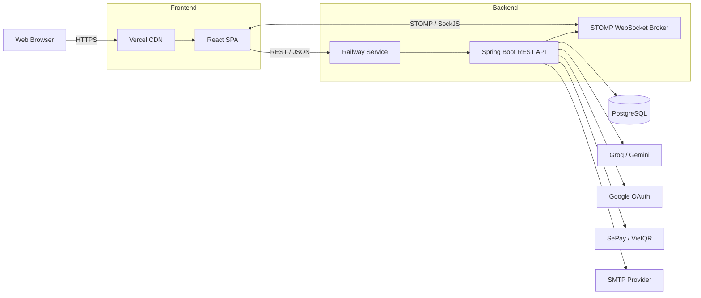
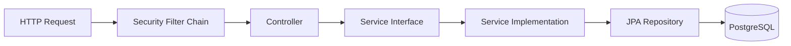
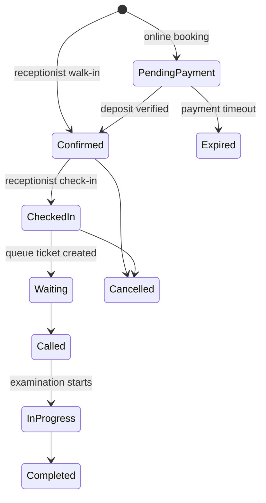
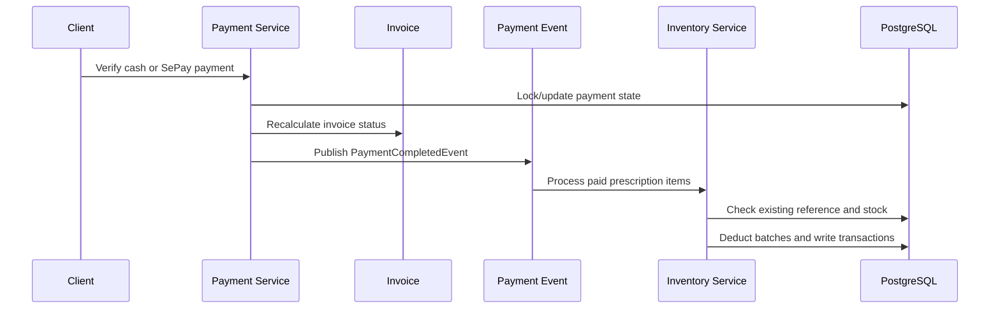

# Smart Medical Clinic Architecture

This document describes the current production-oriented architecture of Smart
Medical Clinic. It focuses on runtime boundaries, security, data flow, and the
engineering decisions that keep a multi-role clinical workflow consistent.

## 1. Runtime Topology

The repository also includes Dockerfiles and a Docker Compose stack for a VPS or
local environment. In that topology, Nginx serves the built SPA and proxies `/api`
and WebSocket traffic to the Spring Boot service.

## 2. Application Layers

Each backend feature owns its controller, service contract, service implementation,
repository, entity, and request/response DTOs.

Responsibilities:

| Layer | Responsibility |
| --- | --- |
| Security filter chain | Authentication, JWT validation, public-route policy, CORS |
| Controller | Request validation, authorization annotations, response mapping |
| Service | Business contract and transaction boundary |
| Service implementation | Workflow rules, ownership checks, state transitions, external integration |
| Repository | Persistence queries through Spring Data JPA |
| Database | Relational integrity and durable workflow state |

## 3. Domain Modules

| Domain | Main responsibilities |
| --- | --- |
| Identity and access | Authentication, Google sign-in, refresh tokens, users, roles, permissions |
| Scheduling | Doctor schedules, generated slots, leave requests, slot expiration and blocking |
| Appointments | Online booking, deposits, walk-ins, check-in, cancellation, appointment state |
| Queue | Number generation, call/skip/complete actions, patient position, WebSocket updates |
| Clinical | Consultations, vital signs, medical records, diagnosis, treatment and follow-up |
| Laboratory | Test catalog, requests, result entry and patient/doctor access |
| Prescriptions | Structured dosing, interaction checks, prescription lifecycle and dispensing |
| Pharmacy inventory | Medicines, suppliers, batches, expiry, imports, exports and transaction history |
| Billing | Services, invoices, cash/online payments, SePay verification and refunds |
| Operations | Notifications, reviews, medical articles, revenue reports, settings and audit logs |
| AI assistance | Patient specialty navigation and clinical-note normalization via provider abstraction |

## 4. Role and Authorization Model

The baseline seed creates six roles:

| Role | Primary access |
| --- | --- |
| `PATIENT` | Own profile, appointments, queue status, records, results, prescriptions, invoices, reviews, AI assistant |
| `DOCTOR` | Assigned clinical work, records, consultations, lab orders, prescriptions, leave requests, article drafts |
| `RECEPTIONIST` | Patient reception, appointments, walk-ins, check-in, queue, invoices, payments and refunds |
| `PHARMACIST` | Medicine catalog, suppliers, batches, stock movement and prescription dispensing |
| `LAB_TECHNICIAN` | Laboratory request processing and result publication |
| `ADMIN` | Users, roles, departments, services, reports, audit logs and approval workflows |

Authorization is enforced in the API using `@PreAuthorize` and service-level
ownership checks. Client-side route guards improve navigation but are not treated as
the security boundary.

## 5. Critical State Flows

### Appointment and queue

Past-time protection is enforced by backend scheduling rules. The UI filters stale
slots for usability, but the API remains the authoritative guard against late or
duplicate booking.

### Payment, dispensing, and inventory

The inventory flow records references and checks previous processing to prevent one
paid prescription from deducting the same stock twice.

## 6. AI and Medication Safety Boundaries

AI calls are isolated behind a provider setting:

- `AI_PROVIDER=groq` uses Groq models.
- `AI_PROVIDER=gemini` uses Gemini models.
- Clinical-note responses are parsed into structured, reviewable fields.
- Patient guidance is limited to specialty navigation and includes a medical-use
  disclaimer.

Medication interaction checking is intentionally deterministic. It compares active
ingredient pairs against a maintained rule set and returns severity plus an
explanation. This makes a warning reproducible and auditable; it is not represented
as an external AI diagnosis.

## 7. Database Lifecycle

- Flyway migrations in `backend/src/main/resources/db/migration` create and evolve
  the production schema.
- JPA entities map the domain model and repositories provide persistence access.
- Production uses `ddl-auto=validate` so schema drift fails fast.
- The baseline seeder is idempotent and creates catalog data, roles, permissions,
  and an optional first administrator.
- Patient records, appointments, doctors, payments, and clinical history are not
  populated with fake deployment data.

## 8. Configuration and Secrets

All environment-specific values are externalized. Important groups include:

| Group | Variables |
| --- | --- |
| Database | `DB_URL`, `DB_USERNAME`, `DB_PASSWORD` |
| Security | `JWT_SECRET`, token expiration values, `CORS_ALLOWED_ORIGINS` |
| Initial admin | `APP_ADMIN_EMAIL`, `APP_ADMIN_PASSWORD`, `APP_ADMIN_FULL_NAME` |
| AI | `AI_PROVIDER`, `GROQ_API_KEY`, `GEMINI_API_KEY` |
| Payment | `SEPAY_API_KEY`, `SEPAY_BANK_ACCOUNT`, `SEPAY_BANK_CODE` |
| OAuth | `GOOGLE_CLIENT_ID`, `VITE_GOOGLE_CLIENT_ID` |
| Email | `APP_MAIL_ENABLED`, SMTP host, port, username and password |

Real credentials belong in Railway, Vercel, VPS environment files, or another
secret manager. The repository contains templates only.

## 9. Verification Strategy

The backend test suite covers high-risk business behavior rather than only context
startup:

- past appointment-slot protection and doctor schedule blocking;
- appointment retrieval and role-aware visibility;
- payment completion, SePay validation, refund policy and revenue aggregation;
- payment-driven inventory deduction and duplicate prevention;
- article draft/approval authorization;
- AI clinical-note parsing and patient-profile context;
- Flyway migration and idempotent baseline seeding.

Frontend verification includes a production Vite build, while ESLint remains
configured for incremental static-analysis cleanup. The Docker/Nginx configuration
also includes SPA fallback routing so direct navigation and refreshes resolve to the
React application.
