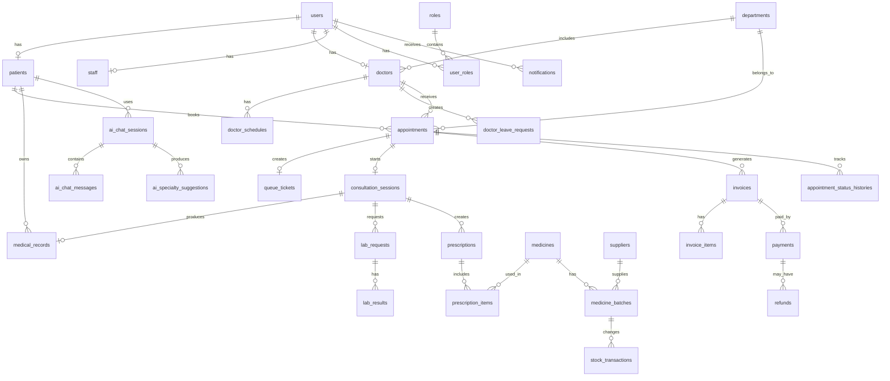

# Database Design — AI Clinic Management System

## 1. Tổng quan thiết kế

Database này được thiết kế cho hệ thống **Quản lý Phòng Khám Thông minh**, hỗ trợ đầy đủ quy trình:

```text
Bệnh nhân đặt lịch
→ Check-in
→ Vào hàng đợi
→ Khám bệnh
→ Xét nghiệm nếu cần
→ Kê đơn thuốc
→ Thanh toán
→ Theo dõi sau khám
```

Hệ thống có các nhóm chức năng chính:

1. Quản lý tài khoản và phân quyền
2. Quản lý bệnh nhân
3. Quản lý bác sĩ, nhân viên và chuyên khoa
4. Quản lý lịch làm việc bác sĩ
5. Quản lý đặt lịch khám
6. Quản lý check-in và hàng đợi
7. Quản lý phiên khám và hồ sơ bệnh án
8. Quản lý xét nghiệm / cận lâm sàng
9. Quản lý kê đơn thuốc
10. Quản lý kho thuốc
11. Quản lý thanh toán và hóa đơn
12. Quản lý AI hỗ trợ
13. Quản lý thông báo
14. Quản lý đánh giá / phản hồi
15. Quản trị hệ thống và audit log

---

## 2. ERD tổng quan



---

# 3. User, Role, Permission

## 3.1. Bảng `users`

Lưu thông tin tài khoản đăng nhập chung cho bệnh nhân, bác sĩ, lễ tân, admin, dược sĩ và nhân viên xét nghiệm.

```sql
CREATE TABLE users (
    user_id BIGINT PRIMARY KEY AUTO_INCREMENT,
    email VARCHAR(255) NOT NULL UNIQUE,
    password_hash VARCHAR(255),
    full_name VARCHAR(150) NOT NULL,
    phone VARCHAR(20),
    avatar_url VARCHAR(500),

    auth_provider ENUM('LOCAL', 'GOOGLE') DEFAULT 'LOCAL',
    provider_id VARCHAR(255),

    status ENUM('ACTIVE', 'INACTIVE', 'LOCKED') DEFAULT 'ACTIVE',

    created_at DATETIME DEFAULT CURRENT_TIMESTAMP,
    updated_at DATETIME DEFAULT CURRENT_TIMESTAMP ON UPDATE CURRENT_TIMESTAMP
);
```

Ghi chú:

- `password_hash` có thể null nếu người dùng đăng nhập bằng Google.
- Không lưu mật khẩu dạng plain text.
- Một user có thể có một hoặc nhiều role.

---

## 3.2. Bảng `roles`

```sql
CREATE TABLE roles (
    role_id BIGINT PRIMARY KEY AUTO_INCREMENT,
    role_name VARCHAR(50) NOT NULL UNIQUE,
    description TEXT
);
```

Dữ liệu mẫu:

```sql
INSERT INTO roles(role_name) VALUES
('PATIENT'),
('DOCTOR'),
('RECEPTIONIST'),
('ADMIN'),
('PHARMACIST'),
('LAB_TECHNICIAN');
```

---

## 3.3. Bảng `user_roles`

```sql
CREATE TABLE user_roles (
    user_id BIGINT NOT NULL,
    role_id BIGINT NOT NULL,

    PRIMARY KEY (user_id, role_id),

    FOREIGN KEY (user_id) REFERENCES users(user_id),
    FOREIGN KEY (role_id) REFERENCES roles(role_id)
);
```

---

## 3.4. Bảng `permissions`

```sql
CREATE TABLE permissions (
    permission_id BIGINT PRIMARY KEY AUTO_INCREMENT,
    permission_code VARCHAR(100) NOT NULL UNIQUE,
    description TEXT
);
```

Ví dụ permission:

```text
MANAGE_USERS
MANAGE_DOCTORS
VIEW_PATIENT_RECORD
CREATE_APPOINTMENT
CREATE_PRESCRIPTION
MANAGE_MEDICINE_STOCK
VIEW_REPORT
```

---

## 3.5. Bảng `role_permissions`

```sql
CREATE TABLE role_permissions (
    role_id BIGINT NOT NULL,
    permission_id BIGINT NOT NULL,

    PRIMARY KEY (role_id, permission_id),

    FOREIGN KEY (role_id) REFERENCES roles(role_id),
    FOREIGN KEY (permission_id) REFERENCES permissions(permission_id)
);
```

---

# 4. Patient — Bệnh nhân

## 4.1. Bảng `patients`

```sql
CREATE TABLE patients (
    patient_id BIGINT PRIMARY KEY AUTO_INCREMENT,
    user_id BIGINT UNIQUE,

    patient_code VARCHAR(30) NOT NULL UNIQUE,

    full_name VARCHAR(150) NOT NULL,
    gender ENUM('MALE', 'FEMALE', 'OTHER') DEFAULT 'OTHER',
    date_of_birth DATE,
    phone VARCHAR(20),
    email VARCHAR(255),
    address TEXT,

    identity_number VARCHAR(30),
    insurance_number VARCHAR(50),

    emergency_contact_name VARCHAR(150),
    emergency_contact_phone VARCHAR(20),

    blood_type VARCHAR(10),
    allergies TEXT,
    medical_history TEXT,

    created_by BIGINT,
    created_at DATETIME DEFAULT CURRENT_TIMESTAMP,
    updated_at DATETIME DEFAULT CURRENT_TIMESTAMP ON UPDATE CURRENT_TIMESTAMP,

    FOREIGN KEY (user_id) REFERENCES users(user_id),
    FOREIGN KEY (created_by) REFERENCES users(user_id)
);
```

Ghi chú:

- `user_id` có thể null vì bệnh nhân walk-in có thể chưa có tài khoản.
- `patient_code` là mã bệnh nhân nội bộ.
- `allergies` dùng để lưu thông tin dị ứng thuốc hoặc thực phẩm.
- `medical_history` lưu tiền sử bệnh.

---

# 5. Department, Doctor, Staff

## 5.1. Bảng `departments`

```sql
CREATE TABLE departments (
    department_id BIGINT PRIMARY KEY AUTO_INCREMENT,
    department_name VARCHAR(150) NOT NULL UNIQUE,
    description TEXT,
    status ENUM('ACTIVE', 'INACTIVE') DEFAULT 'ACTIVE',
    created_at DATETIME DEFAULT CURRENT_TIMESTAMP
);
```

Ví dụ chuyên khoa:

```text
Nội tổng quát
Tai mũi họng
Da liễu
Nhi khoa
Tim mạch
Sản phụ khoa
```

---

## 5.2. Bảng `doctors`

```sql
CREATE TABLE doctors (
    doctor_id BIGINT PRIMARY KEY AUTO_INCREMENT,
    user_id BIGINT NOT NULL UNIQUE,
    department_id BIGINT NOT NULL,

    doctor_code VARCHAR(30) NOT NULL UNIQUE,
    degree VARCHAR(100),
    specialization VARCHAR(150),
    years_of_experience INT DEFAULT 0,
    biography TEXT,
    consultation_fee DECIMAL(12,2) DEFAULT 0,

    status ENUM('ACTIVE', 'INACTIVE', 'ON_LEAVE') DEFAULT 'ACTIVE',

    created_at DATETIME DEFAULT CURRENT_TIMESTAMP,
    updated_at DATETIME DEFAULT CURRENT_TIMESTAMP ON UPDATE CURRENT_TIMESTAMP,

    FOREIGN KEY (user_id) REFERENCES users(user_id),
    FOREIGN KEY (department_id) REFERENCES departments(department_id)
);
```

---

## 5.3. Bảng `staff`

```sql
CREATE TABLE staff (
    staff_id BIGINT PRIMARY KEY AUTO_INCREMENT,
    user_id BIGINT NOT NULL UNIQUE,

    staff_code VARCHAR(30) NOT NULL UNIQUE,
    staff_type ENUM('RECEPTIONIST', 'PHARMACIST', 'LAB_TECHNICIAN', 'ADMIN') NOT NULL,

    position VARCHAR(100),
    status ENUM('ACTIVE', 'INACTIVE') DEFAULT 'ACTIVE',

    created_at DATETIME DEFAULT CURRENT_TIMESTAMP,
    updated_at DATETIME DEFAULT CURRENT_TIMESTAMP ON UPDATE CURRENT_TIMESTAMP,

    FOREIGN KEY (user_id) REFERENCES users(user_id)
);
```

---

# 6. Lịch làm việc bác sĩ

## 6.1. Bảng `doctor_schedules`

```sql
CREATE TABLE doctor_schedules (
    schedule_id BIGINT PRIMARY KEY AUTO_INCREMENT,
    doctor_id BIGINT NOT NULL,

    work_date DATE NOT NULL,
    start_time TIME NOT NULL,
    end_time TIME NOT NULL,

    max_patients INT DEFAULT 20,

    status ENUM('AVAILABLE', 'FULL', 'CANCELLED', 'ON_LEAVE') DEFAULT 'AVAILABLE',

    created_at DATETIME DEFAULT CURRENT_TIMESTAMP,

    FOREIGN KEY (doctor_id) REFERENCES doctors(doctor_id),

    UNIQUE (doctor_id, work_date, start_time, end_time)
);
```

---

## 6.2. Bảng `appointment_slots`

```sql
CREATE TABLE appointment_slots (
    slot_id BIGINT PRIMARY KEY AUTO_INCREMENT,
    schedule_id BIGINT NOT NULL,

    start_time TIME NOT NULL,
    end_time TIME NOT NULL,

    status ENUM('AVAILABLE', 'LOCKED', 'BOOKED', 'CANCELLED') DEFAULT 'AVAILABLE',

    locked_until DATETIME,
    locked_by_patient_id BIGINT,

    created_at DATETIME DEFAULT CURRENT_TIMESTAMP,

    FOREIGN KEY (schedule_id) REFERENCES doctor_schedules(schedule_id),
    FOREIGN KEY (locked_by_patient_id) REFERENCES patients(patient_id)
);
```

Ghi chú:

- `LOCKED`: giữ chỗ tạm thời trong lúc bệnh nhân thanh toán.
- `BOOKED`: đã đặt lịch thành công.
- `AVAILABLE`: còn trống.

---

## 6.3. Bảng `doctor_leave_requests`

```sql
CREATE TABLE doctor_leave_requests (
    leave_request_id BIGINT PRIMARY KEY AUTO_INCREMENT,
    doctor_id BIGINT NOT NULL,

    request_type ENUM('LEAVE', 'CHANGE_SCHEDULE') NOT NULL,

    from_datetime DATETIME NOT NULL,
    to_datetime DATETIME NOT NULL,

    reason TEXT,

    status ENUM('PENDING', 'APPROVED', 'REJECTED') DEFAULT 'PENDING',

    approved_by BIGINT,
    approved_at DATETIME,

    created_at DATETIME DEFAULT CURRENT_TIMESTAMP,

    FOREIGN KEY (doctor_id) REFERENCES doctors(doctor_id),
    FOREIGN KEY (approved_by) REFERENCES users(user_id)
);
```

---

# 7. Appointment — Đặt lịch khám

## 7.1. Bảng `appointments`

```sql
CREATE TABLE appointments (
    appointment_id BIGINT PRIMARY KEY AUTO_INCREMENT,

    appointment_code VARCHAR(30) NOT NULL UNIQUE,

    patient_id BIGINT NOT NULL,
    doctor_id BIGINT NOT NULL,
    department_id BIGINT NOT NULL,
    slot_id BIGINT,

    appointment_date DATE NOT NULL,
    start_time TIME NOT NULL,
    end_time TIME NOT NULL,

    booking_type ENUM('ONLINE', 'OFFLINE', 'WALK_IN') NOT NULL,

    reason_for_visit TEXT,
    initial_symptoms TEXT,

    status ENUM(
        'PENDING_PAYMENT',
        'CONFIRMED',
        'CHECKED_IN',
        'WAITING',
        'IN_PROGRESS',
        'COMPLETED',
        'CANCELLED',
        'NO_SHOW',
        'RESCHEDULED'
    ) DEFAULT 'PENDING_PAYMENT',

    deposit_amount DECIMAL(12,2) DEFAULT 0,

    created_by BIGINT,
    cancelled_by BIGINT,
    cancellation_reason TEXT,
    cancelled_at DATETIME,

    rescheduled_from_id BIGINT,

    created_at DATETIME DEFAULT CURRENT_TIMESTAMP,
    updated_at DATETIME DEFAULT CURRENT_TIMESTAMP ON UPDATE CURRENT_TIMESTAMP,

    FOREIGN KEY (patient_id) REFERENCES patients(patient_id),
    FOREIGN KEY (doctor_id) REFERENCES doctors(doctor_id),
    FOREIGN KEY (department_id) REFERENCES departments(department_id),
    FOREIGN KEY (slot_id) REFERENCES appointment_slots(slot_id),
    FOREIGN KEY (created_by) REFERENCES users(user_id),
    FOREIGN KEY (cancelled_by) REFERENCES users(user_id),
    FOREIGN KEY (rescheduled_from_id) REFERENCES appointments(appointment_id)
);
```

---

## 7.2. Bảng `appointment_status_histories`

```sql
CREATE TABLE appointment_status_histories (
    history_id BIGINT PRIMARY KEY AUTO_INCREMENT,

    appointment_id BIGINT NOT NULL,

    old_status VARCHAR(50),
    new_status VARCHAR(50) NOT NULL,

    changed_by BIGINT,
    note TEXT,

    changed_at DATETIME DEFAULT CURRENT_TIMESTAMP,

    FOREIGN KEY (appointment_id) REFERENCES appointments(appointment_id),
    FOREIGN KEY (changed_by) REFERENCES users(user_id)
);
```

Ví dụ flow trạng thái:

```text
PENDING_PAYMENT → CONFIRMED
CONFIRMED → CHECKED_IN
CHECKED_IN → WAITING
WAITING → IN_PROGRESS
IN_PROGRESS → COMPLETED
```

---

# 8. Check-in và hàng đợi

## 8.1. Bảng `queue_tickets`

```sql
CREATE TABLE queue_tickets (
    queue_ticket_id BIGINT PRIMARY KEY AUTO_INCREMENT,

    appointment_id BIGINT NOT NULL UNIQUE,
    patient_id BIGINT NOT NULL,
    doctor_id BIGINT NOT NULL,
    department_id BIGINT NOT NULL,

    queue_number INT NOT NULL,

    priority_level ENUM('NORMAL', 'PRIORITY', 'EMERGENCY') DEFAULT 'NORMAL',

    status ENUM(
        'WAITING',
        'CALLED',
        'IN_EXAMINATION',
        'WAITING_LAB',
        'DONE',
        'CANCELLED',
        'SKIPPED'
    ) DEFAULT 'WAITING',

    estimated_wait_minutes INT,

    checked_in_at DATETIME,
    called_at DATETIME,
    completed_at DATETIME,

    created_at DATETIME DEFAULT CURRENT_TIMESTAMP,

    FOREIGN KEY (appointment_id) REFERENCES appointments(appointment_id),
    FOREIGN KEY (patient_id) REFERENCES patients(patient_id),
    FOREIGN KEY (doctor_id) REFERENCES doctors(doctor_id),
    FOREIGN KEY (department_id) REFERENCES departments(department_id)
);
```

---

# 9. Phiên khám và hồ sơ bệnh án

## 9.1. Bảng `consultation_sessions`

```sql
CREATE TABLE consultation_sessions (
    consultation_id BIGINT PRIMARY KEY AUTO_INCREMENT,

    appointment_id BIGINT NOT NULL UNIQUE,
    patient_id BIGINT NOT NULL,
    doctor_id BIGINT NOT NULL,

    status ENUM(
        'WAITING',
        'IN_PROGRESS',
        'WAITING_LAB_RESULT',
        'PRESCRIBED',
        'COMPLETED'
    ) DEFAULT 'WAITING',

    started_at DATETIME,
    completed_at DATETIME,

    created_at DATETIME DEFAULT CURRENT_TIMESTAMP,
    updated_at DATETIME DEFAULT CURRENT_TIMESTAMP ON UPDATE CURRENT_TIMESTAMP,

    FOREIGN KEY (appointment_id) REFERENCES appointments(appointment_id),
    FOREIGN KEY (patient_id) REFERENCES patients(patient_id),
    FOREIGN KEY (doctor_id) REFERENCES doctors(doctor_id)
);
```

---

## 9.2. Bảng `medical_records`

```sql
CREATE TABLE medical_records (
    medical_record_id BIGINT PRIMARY KEY AUTO_INCREMENT,

    consultation_id BIGINT NOT NULL UNIQUE,
    patient_id BIGINT NOT NULL,
    doctor_id BIGINT NOT NULL,

    symptoms TEXT,
    clinical_findings TEXT,
    diagnosis TEXT,
    treatment_plan TEXT,
    doctor_note TEXT,

    follow_up_date DATE,
    follow_up_note TEXT,

    voice_input_transcript TEXT,
    ai_summary TEXT,

    created_at DATETIME DEFAULT CURRENT_TIMESTAMP,
    updated_at DATETIME DEFAULT CURRENT_TIMESTAMP ON UPDATE CURRENT_TIMESTAMP,

    FOREIGN KEY (consultation_id) REFERENCES consultation_sessions(consultation_id),
    FOREIGN KEY (patient_id) REFERENCES patients(patient_id),
    FOREIGN KEY (doctor_id) REFERENCES doctors(doctor_id)
);
```

Ghi chú:

- `voice_input_transcript`: nội dung bác sĩ nhập bằng giọng nói.
- `ai_summary`: bản tóm tắt hỗ trợ bởi AI.
- `diagnosis`: chẩn đoán cuối cùng do bác sĩ nhập.

---

## 9.3. Bảng `vital_signs`

```sql
CREATE TABLE vital_signs (
    vital_sign_id BIGINT PRIMARY KEY AUTO_INCREMENT,

    consultation_id BIGINT NOT NULL,
    patient_id BIGINT NOT NULL,

    height_cm DECIMAL(5,2),
    weight_kg DECIMAL(5,2),
    temperature_c DECIMAL(4,1),
    blood_pressure_systolic INT,
    blood_pressure_diastolic INT,
    heart_rate INT,
    respiratory_rate INT,
    spo2 INT,

    measured_by BIGINT,
    measured_at DATETIME DEFAULT CURRENT_TIMESTAMP,

    FOREIGN KEY (consultation_id) REFERENCES consultation_sessions(consultation_id),
    FOREIGN KEY (patient_id) REFERENCES patients(patient_id),
    FOREIGN KEY (measured_by) REFERENCES users(user_id)
);
```

---

# 10. Xét nghiệm / cận lâm sàng

## 10.1. Bảng `lab_tests`

```sql
CREATE TABLE lab_tests (
    lab_test_id BIGINT PRIMARY KEY AUTO_INCREMENT,

    test_code VARCHAR(30) NOT NULL UNIQUE,
    test_name VARCHAR(150) NOT NULL,
    description TEXT,

    price DECIMAL(12,2) DEFAULT 0,

    status ENUM('ACTIVE', 'INACTIVE') DEFAULT 'ACTIVE',

    created_at DATETIME DEFAULT CURRENT_TIMESTAMP
);
```

---

## 10.2. Bảng `lab_requests`

```sql
CREATE TABLE lab_requests (
    lab_request_id BIGINT PRIMARY KEY AUTO_INCREMENT,

    consultation_id BIGINT NOT NULL,
    patient_id BIGINT NOT NULL,
    doctor_id BIGINT NOT NULL,

    request_code VARCHAR(30) NOT NULL UNIQUE,

    status ENUM('REQUESTED', 'IN_PROGRESS', 'COMPLETED', 'CANCELLED') DEFAULT 'REQUESTED',

    note TEXT,

    requested_at DATETIME DEFAULT CURRENT_TIMESTAMP,
    accepted_by BIGINT,
    accepted_at DATETIME,
    completed_at DATETIME,

    FOREIGN KEY (consultation_id) REFERENCES consultation_sessions(consultation_id),
    FOREIGN KEY (patient_id) REFERENCES patients(patient_id),
    FOREIGN KEY (doctor_id) REFERENCES doctors(doctor_id),
    FOREIGN KEY (accepted_by) REFERENCES users(user_id)
);
```

---

## 10.3. Bảng `lab_request_items`

```sql
CREATE TABLE lab_request_items (
    lab_request_item_id BIGINT PRIMARY KEY AUTO_INCREMENT,

    lab_request_id BIGINT NOT NULL,
    lab_test_id BIGINT NOT NULL,

    status ENUM('REQUESTED', 'IN_PROGRESS', 'COMPLETED', 'CANCELLED') DEFAULT 'REQUESTED',

    FOREIGN KEY (lab_request_id) REFERENCES lab_requests(lab_request_id),
    FOREIGN KEY (lab_test_id) REFERENCES lab_tests(lab_test_id)
);
```

---

## 10.4. Bảng `lab_results`

```sql
CREATE TABLE lab_results (
    lab_result_id BIGINT PRIMARY KEY AUTO_INCREMENT,

    lab_request_item_id BIGINT NOT NULL,

    result_value TEXT,
    normal_range VARCHAR(100),
    result_unit VARCHAR(50),

    conclusion TEXT,
    result_file_url VARCHAR(500),

    entered_by BIGINT,
    entered_at DATETIME DEFAULT CURRENT_TIMESTAMP,

    FOREIGN KEY (lab_request_item_id) REFERENCES lab_request_items(lab_request_item_id),
    FOREIGN KEY (entered_by) REFERENCES users(user_id)
);
```

---

# 11. Dịch vụ y tế / gói khám

## 11.1. Bảng `medical_services`

```sql
CREATE TABLE medical_services (
    service_id BIGINT PRIMARY KEY AUTO_INCREMENT,

    service_code VARCHAR(30) NOT NULL UNIQUE,
    service_name VARCHAR(150) NOT NULL,

    service_type ENUM('CONSULTATION', 'LAB_TEST', 'PACKAGE', 'OTHER') DEFAULT 'OTHER',

    price DECIMAL(12,2) NOT NULL DEFAULT 0,

    description TEXT,

    status ENUM('ACTIVE', 'INACTIVE') DEFAULT 'ACTIVE',

    created_at DATETIME DEFAULT CURRENT_TIMESTAMP
);
```

---

# 12. Đơn thuốc

## 12.1. Bảng `medicines`

```sql
CREATE TABLE medicines (
    medicine_id BIGINT PRIMARY KEY AUTO_INCREMENT,

    medicine_code VARCHAR(30) NOT NULL UNIQUE,
    medicine_name VARCHAR(150) NOT NULL,

    active_ingredient VARCHAR(255),
    dosage_form VARCHAR(100),
    strength VARCHAR(100),
    unit VARCHAR(50),

    rxnorm_code VARCHAR(100),

    description TEXT,

    status ENUM('ACTIVE', 'INACTIVE') DEFAULT 'ACTIVE',

    created_at DATETIME DEFAULT CURRENT_TIMESTAMP,
    updated_at DATETIME DEFAULT CURRENT_TIMESTAMP ON UPDATE CURRENT_TIMESTAMP
);
```

---

## 12.2. Bảng `prescriptions`

```sql
CREATE TABLE prescriptions (
    prescription_id BIGINT PRIMARY KEY AUTO_INCREMENT,

    prescription_code VARCHAR(30) NOT NULL UNIQUE,

    consultation_id BIGINT NOT NULL,
    patient_id BIGINT NOT NULL,
    doctor_id BIGINT NOT NULL,

    status ENUM('CREATED', 'CHECKED', 'DISPENSED', 'CANCELLED') DEFAULT 'CREATED',

    drug_interaction_checked BOOLEAN DEFAULT FALSE,
    interaction_warning TEXT,

    doctor_note TEXT,

    created_at DATETIME DEFAULT CURRENT_TIMESTAMP,
    checked_at DATETIME,
    dispensed_at DATETIME,

    FOREIGN KEY (consultation_id) REFERENCES consultation_sessions(consultation_id),
    FOREIGN KEY (patient_id) REFERENCES patients(patient_id),
    FOREIGN KEY (doctor_id) REFERENCES doctors(doctor_id)
);
```

---

## 12.3. Bảng `prescription_items`

```sql
CREATE TABLE prescription_items (
    prescription_item_id BIGINT PRIMARY KEY AUTO_INCREMENT,

    prescription_id BIGINT NOT NULL,
    medicine_id BIGINT NOT NULL,

    quantity INT NOT NULL,

    dosage VARCHAR(255),
    frequency VARCHAR(255),
    duration VARCHAR(255),
    instructions TEXT,

    morning_dose VARCHAR(50),
    noon_dose VARCHAR(50),
    evening_dose VARCHAR(50),
    night_dose VARCHAR(50),

    FOREIGN KEY (prescription_id) REFERENCES prescriptions(prescription_id),
    FOREIGN KEY (medicine_id) REFERENCES medicines(medicine_id)
);
```

---

## 12.4. Bảng `drug_interaction_checks`

```sql
CREATE TABLE drug_interaction_checks (
    check_id BIGINT PRIMARY KEY AUTO_INCREMENT,

    prescription_id BIGINT NOT NULL,

    api_provider ENUM('RXNORM', 'DRUG_INTERACTION_API', 'OTHER') DEFAULT 'RXNORM',

    request_payload JSON,
    response_payload JSON,

    warning_level ENUM('NONE', 'LOW', 'MEDIUM', 'HIGH', 'SEVERE') DEFAULT 'NONE',

    warning_message TEXT,

    checked_at DATETIME DEFAULT CURRENT_TIMESTAMP,

    FOREIGN KEY (prescription_id) REFERENCES prescriptions(prescription_id)
);
```

---

# 13. Kho thuốc

## 13.1. Bảng `suppliers`

```sql
CREATE TABLE suppliers (
    supplier_id BIGINT PRIMARY KEY AUTO_INCREMENT,

    supplier_name VARCHAR(150) NOT NULL,
    phone VARCHAR(20),
    email VARCHAR(255),
    address TEXT,

    status ENUM('ACTIVE', 'INACTIVE') DEFAULT 'ACTIVE',

    created_at DATETIME DEFAULT CURRENT_TIMESTAMP
);
```

---

## 13.2. Bảng `medicine_batches`

```sql
CREATE TABLE medicine_batches (
    batch_id BIGINT PRIMARY KEY AUTO_INCREMENT,

    medicine_id BIGINT NOT NULL,
    supplier_id BIGINT,

    batch_number VARCHAR(100) NOT NULL,

    manufacture_date DATE,
    expiry_date DATE NOT NULL,

    import_price DECIMAL(12,2) DEFAULT 0,
    selling_price DECIMAL(12,2) DEFAULT 0,

    initial_quantity INT NOT NULL,
    current_quantity INT NOT NULL,

    status ENUM('AVAILABLE', 'LOW_STOCK', 'EXPIRED', 'OUT_OF_STOCK') DEFAULT 'AVAILABLE',

    imported_by BIGINT,
    imported_at DATETIME DEFAULT CURRENT_TIMESTAMP,

    FOREIGN KEY (medicine_id) REFERENCES medicines(medicine_id),
    FOREIGN KEY (supplier_id) REFERENCES suppliers(supplier_id),
    FOREIGN KEY (imported_by) REFERENCES users(user_id)
);
```

---

## 13.3. Bảng `stock_transactions`

```sql
CREATE TABLE stock_transactions (
    stock_transaction_id BIGINT PRIMARY KEY AUTO_INCREMENT,

    medicine_id BIGINT NOT NULL,
    batch_id BIGINT,

    transaction_type ENUM('IMPORT', 'EXPORT', 'ADJUSTMENT', 'RETURN', 'EXPIRED_REMOVAL') NOT NULL,

    quantity INT NOT NULL,

    reference_type ENUM('PRESCRIPTION', 'MANUAL', 'SUPPLIER_IMPORT', 'OTHER') DEFAULT 'OTHER',
    reference_id BIGINT,

    note TEXT,

    created_by BIGINT,
    created_at DATETIME DEFAULT CURRENT_TIMESTAMP,

    FOREIGN KEY (medicine_id) REFERENCES medicines(medicine_id),
    FOREIGN KEY (batch_id) REFERENCES medicine_batches(batch_id),
    FOREIGN KEY (created_by) REFERENCES users(user_id)
);
```

---

## 13.4. Bảng `medicine_stock_alerts`

```sql
CREATE TABLE medicine_stock_alerts (
    alert_id BIGINT PRIMARY KEY AUTO_INCREMENT,

    medicine_id BIGINT NOT NULL,
    batch_id BIGINT,

    alert_type ENUM('LOW_STOCK', 'EXPIRED', 'NEAR_EXPIRY') NOT NULL,

    message TEXT,

    is_resolved BOOLEAN DEFAULT FALSE,
    resolved_by BIGINT,
    resolved_at DATETIME,

    created_at DATETIME DEFAULT CURRENT_TIMESTAMP,

    FOREIGN KEY (medicine_id) REFERENCES medicines(medicine_id),
    FOREIGN KEY (batch_id) REFERENCES medicine_batches(batch_id),
    FOREIGN KEY (resolved_by) REFERENCES users(user_id)
);
```

---

# 14. Thanh toán và hóa đơn

## 14.1. Bảng `invoices`

```sql
CREATE TABLE invoices (
    invoice_id BIGINT PRIMARY KEY AUTO_INCREMENT,

    invoice_code VARCHAR(30) NOT NULL UNIQUE,

    patient_id BIGINT NOT NULL,
    appointment_id BIGINT,

    total_amount DECIMAL(12,2) NOT NULL DEFAULT 0,
    discount_amount DECIMAL(12,2) DEFAULT 0,
    final_amount DECIMAL(12,2) NOT NULL DEFAULT 0,

    status ENUM('UNPAID', 'PENDING', 'PAID', 'FAILED', 'REFUNDED', 'CANCELLED') DEFAULT 'UNPAID',

    created_by BIGINT,
    created_at DATETIME DEFAULT CURRENT_TIMESTAMP,
    paid_at DATETIME,

    FOREIGN KEY (patient_id) REFERENCES patients(patient_id),
    FOREIGN KEY (appointment_id) REFERENCES appointments(appointment_id),
    FOREIGN KEY (created_by) REFERENCES users(user_id)
);
```

---

## 14.2. Bảng `invoice_items`

```sql
CREATE TABLE invoice_items (
    invoice_item_id BIGINT PRIMARY KEY AUTO_INCREMENT,

    invoice_id BIGINT NOT NULL,

    item_type ENUM('CONSULTATION', 'LAB_TEST', 'MEDICINE', 'SERVICE', 'DEPOSIT') NOT NULL,

    reference_id BIGINT,

    item_name VARCHAR(255) NOT NULL,

    quantity INT DEFAULT 1,
    unit_price DECIMAL(12,2) NOT NULL,
    total_price DECIMAL(12,2) NOT NULL,

    FOREIGN KEY (invoice_id) REFERENCES invoices(invoice_id)
);
```

---

## 14.3. Bảng `payments`

```sql
CREATE TABLE payments (
    payment_id BIGINT PRIMARY KEY AUTO_INCREMENT,

    invoice_id BIGINT,
    appointment_id BIGINT,

    payment_code VARCHAR(30) NOT NULL UNIQUE,

    payment_type ENUM('DEPOSIT', 'FINAL_PAYMENT') NOT NULL,

    payment_method ENUM('CASH', 'ONLINE', 'BANK_TRANSFER', 'CARD') NOT NULL,

    amount DECIMAL(12,2) NOT NULL,

    status ENUM('UNPAID', 'PENDING', 'PAID', 'FAILED', 'REFUNDED', 'CANCELLED') DEFAULT 'PENDING',

    gateway_provider VARCHAR(100),
    gateway_transaction_id VARCHAR(255),

    paid_by BIGINT,
    confirmed_by BIGINT,

    paid_at DATETIME,
    created_at DATETIME DEFAULT CURRENT_TIMESTAMP,

    FOREIGN KEY (invoice_id) REFERENCES invoices(invoice_id),
    FOREIGN KEY (appointment_id) REFERENCES appointments(appointment_id),
    FOREIGN KEY (paid_by) REFERENCES users(user_id),
    FOREIGN KEY (confirmed_by) REFERENCES users(user_id)
);
```
---

## 14.4. Bảng `refunds`

```sql
CREATE TABLE refunds (
    refund_id BIGINT PRIMARY KEY AUTO_INCREMENT,

    payment_id BIGINT NOT NULL,

    refund_code VARCHAR(30) NOT NULL UNIQUE,

    refund_amount DECIMAL(12,2) NOT NULL,
    reason TEXT,

    status ENUM('PENDING', 'APPROVED', 'REJECTED', 'COMPLETED', 'FAILED') DEFAULT 'PENDING',

    requested_by BIGINT,
    approved_by BIGINT,

    requested_at DATETIME DEFAULT CURRENT_TIMESTAMP,
    approved_at DATETIME,
    completed_at DATETIME,

    FOREIGN KEY (payment_id) REFERENCES payments(payment_id),
    FOREIGN KEY (requested_by) REFERENCES users(user_id),
    FOREIGN KEY (approved_by) REFERENCES users(user_id)
);
```

---

# 15. AI hỗ trợ

## 15.1. Bảng `ai_chat_sessions`

```sql
CREATE TABLE ai_chat_sessions (
    ai_chat_session_id BIGINT PRIMARY KEY AUTO_INCREMENT,

    patient_id BIGINT,

    session_type ENUM('SYMPTOM_CHECK', 'SPECIALTY_SUGGESTION', 'TRIAGE_SUPPORT') DEFAULT 'SYMPTOM_CHECK',

    summary TEXT,

    created_at DATETIME DEFAULT CURRENT_TIMESTAMP,

    FOREIGN KEY (patient_id) REFERENCES patients(patient_id)
);
```

---

## 15.2. Bảng `ai_chat_messages`

```sql
CREATE TABLE ai_chat_messages (
    ai_chat_message_id BIGINT PRIMARY KEY AUTO_INCREMENT,

    ai_chat_session_id BIGINT NOT NULL,

    sender_type ENUM('PATIENT', 'AI') NOT NULL,

    message_text TEXT NOT NULL,

    created_at DATETIME DEFAULT CURRENT_TIMESTAMP,

    FOREIGN KEY (ai_chat_session_id) REFERENCES ai_chat_sessions(ai_chat_session_id)
);
```

---

## 15.3. Bảng `ai_specialty_suggestions`

```sql
CREATE TABLE ai_specialty_suggestions (
    suggestion_id BIGINT PRIMARY KEY AUTO_INCREMENT,

    ai_chat_session_id BIGINT NOT NULL,
    patient_id BIGINT,

    department_id BIGINT,

    symptoms_text TEXT,

    confidence_score DECIMAL(5,2),

    explanation TEXT,

    accepted_by_patient BOOLEAN DEFAULT FALSE,

    created_at DATETIME DEFAULT CURRENT_TIMESTAMP,

    FOREIGN KEY (ai_chat_session_id) REFERENCES ai_chat_sessions(ai_chat_session_id),
    FOREIGN KEY (patient_id) REFERENCES patients(patient_id),
    FOREIGN KEY (department_id) REFERENCES departments(department_id)
);
```

---

## 15.4. Bảng `ai_voice_transcriptions`

```sql
CREATE TABLE ai_voice_transcriptions (
    transcription_id BIGINT PRIMARY KEY AUTO_INCREMENT,

    consultation_id BIGINT NOT NULL,
    doctor_id BIGINT NOT NULL,

    audio_file_url VARCHAR(500),
    transcript_text TEXT,

    ai_processed_text TEXT,

    created_at DATETIME DEFAULT CURRENT_TIMESTAMP,

    FOREIGN KEY (consultation_id) REFERENCES consultation_sessions(consultation_id),
    FOREIGN KEY (doctor_id) REFERENCES doctors(doctor_id)
);
```

---

# 16. Thông báo

## 16.1. Bảng `notifications`

```sql
CREATE TABLE notifications (
    notification_id BIGINT PRIMARY KEY AUTO_INCREMENT,

    user_id BIGINT NOT NULL,

    title VARCHAR(255) NOT NULL,
    message TEXT NOT NULL,

    notification_type ENUM(
        'APPOINTMENT_REMINDER',
        'PAYMENT',
        'LAB_RESULT',
        'PRESCRIPTION',
        'QUEUE_UPDATE',
        'SYSTEM',
        'FOLLOW_UP'
    ) DEFAULT 'SYSTEM',

    is_read BOOLEAN DEFAULT FALSE,

    related_type VARCHAR(100),
    related_id BIGINT,

    created_at DATETIME DEFAULT CURRENT_TIMESTAMP,
    read_at DATETIME,

    FOREIGN KEY (user_id) REFERENCES users(user_id)
);
```

---

# 17. Đánh giá / phản hồi

## 17.1. Bảng `reviews`

```sql
CREATE TABLE reviews (
    review_id BIGINT PRIMARY KEY AUTO_INCREMENT,

    patient_id BIGINT NOT NULL,
    doctor_id BIGINT,
    appointment_id BIGINT,

    rating INT NOT NULL CHECK (rating BETWEEN 1 AND 5),

    comment TEXT,

    status ENUM('VISIBLE', 'HIDDEN') DEFAULT 'VISIBLE',

    created_at DATETIME DEFAULT CURRENT_TIMESTAMP,

    FOREIGN KEY (patient_id) REFERENCES patients(patient_id),
    FOREIGN KEY (doctor_id) REFERENCES doctors(doctor_id),
    FOREIGN KEY (appointment_id) REFERENCES appointments(appointment_id)
);
```

---

# 18. Tin tức / bài viết y tế

## 18.1. Bảng `articles`

```sql
CREATE TABLE articles (
    article_id BIGINT PRIMARY KEY AUTO_INCREMENT,

    title VARCHAR(255) NOT NULL,
    slug VARCHAR(255) NOT NULL UNIQUE,

    content TEXT NOT NULL,
    thumbnail_url VARCHAR(500),

    status ENUM('DRAFT', 'PUBLISHED', 'ARCHIVED') DEFAULT 'DRAFT',

    created_by BIGINT,
    published_at DATETIME,

    created_at DATETIME DEFAULT CURRENT_TIMESTAMP,
    updated_at DATETIME DEFAULT CURRENT_TIMESTAMP ON UPDATE CURRENT_TIMESTAMP,

    FOREIGN KEY (created_by) REFERENCES users(user_id)
);
```

---

# 19. Audit log

## 19.1. Bảng `audit_logs`

```sql
CREATE TABLE audit_logs (
    audit_log_id BIGINT PRIMARY KEY AUTO_INCREMENT,

    user_id BIGINT,

    action VARCHAR(100) NOT NULL,

    table_name VARCHAR(100),
    record_id BIGINT,

    old_value JSON,
    new_value JSON,

    ip_address VARCHAR(100),
    user_agent TEXT,

    created_at DATETIME DEFAULT CURRENT_TIMESTAMP,

    FOREIGN KEY (user_id) REFERENCES users(user_id)
);
```

Dùng để lưu:

```text
Admin sửa thông tin bác sĩ
Bác sĩ cập nhật bệnh án
Lễ tân hủy lịch
Dược sĩ xuất thuốc
Nhân viên xét nghiệm nhập kết quả
```

---

# 20. Cấu hình hệ thống

## 20.1. Bảng `system_settings`

```sql
CREATE TABLE system_settings (
    setting_id BIGINT PRIMARY KEY AUTO_INCREMENT,

    setting_key VARCHAR(100) NOT NULL UNIQUE,
    setting_value TEXT,
    description TEXT,

    updated_by BIGINT,
    updated_at DATETIME DEFAULT CURRENT_TIMESTAMP ON UPDATE CURRENT_TIMESTAMP,

    FOREIGN KEY (updated_by) REFERENCES users(user_id)
);
```

Ví dụ:

```text
appointment_deposit_amount = 50000
low_stock_threshold = 20
near_expiry_days = 30
clinic_open_time = 07:00
clinic_close_time = 17:00
```

---

# 21. Các trạng thái quan trọng

## 21.1. Appointment status

```text
PENDING_PAYMENT
CONFIRMED
CHECKED_IN
WAITING
IN_PROGRESS
COMPLETED
CANCELLED
NO_SHOW
RESCHEDULED
```

## 21.2. Consultation status

```text
WAITING
IN_PROGRESS
WAITING_LAB_RESULT
PRESCRIBED
COMPLETED
```

## 21.3. Payment status

```text
UNPAID
PENDING
PAID
FAILED
REFUNDED
CANCELLED
```

## 21.4. Lab status

```text
REQUESTED
IN_PROGRESS
COMPLETED
CANCELLED
```

## 21.5. Prescription status

```text
CREATED
CHECKED
DISPENSED
CANCELLED
```

---

# 22. Flow nghiệp vụ map với database

## 22.1. Flow đặt lịch online

```text
users
↓
patients
↓
ai_chat_sessions
↓
ai_specialty_suggestions
↓
departments
↓
doctor_schedules
↓
appointment_slots
↓
appointments: PENDING_PAYMENT
↓
payments: PENDING
↓
payments: PAID
↓
appointments: CONFIRMED
↓
notifications
```

---

## 22.2. Flow check-in tại quầy

```text
appointments: CONFIRMED
↓
appointments: CHECKED_IN
↓
queue_tickets
↓
appointments: WAITING
↓
notifications
```

---

## 22.3. Flow bác sĩ khám

```text
queue_tickets: WAITING
↓
consultation_sessions: IN_PROGRESS
↓
medical_records
↓
vital_signs
↓
lab_requests nếu cần
↓
prescriptions
↓
consultation_sessions: COMPLETED
↓
appointments: COMPLETED
```

---

## 22.4. Flow xét nghiệm

```text
consultation_sessions
↓
lab_requests
↓
lab_request_items
↓
lab_results
↓
consultation_sessions: WAITING_LAB_RESULT hoặc IN_PROGRESS
```

---

## 22.5. Flow kê đơn và cấp thuốc

```text
prescriptions
↓
prescription_items
↓
drug_interaction_checks
↓
medicine_batches
↓
stock_transactions
↓
prescriptions: DISPENSED
```

---

## 22.6. Flow thanh toán cuối

```text
appointments
↓
invoices
↓
invoice_items
↓
payments
↓
payments: PAID
↓
invoices: PAID
```

---

# 23. Index nên tạo

```sql
CREATE INDEX idx_users_email ON users(email);

CREATE INDEX idx_patients_phone ON patients(phone);
CREATE INDEX idx_patients_code ON patients(patient_code);

CREATE INDEX idx_appointments_patient ON appointments(patient_id);
CREATE INDEX idx_appointments_doctor_date ON appointments(doctor_id, appointment_date);
CREATE INDEX idx_appointments_status ON appointments(status);

CREATE INDEX idx_queue_doctor_status ON queue_tickets(doctor_id, status);

CREATE INDEX idx_consultation_patient ON consultation_sessions(patient_id);
CREATE INDEX idx_medical_records_patient ON medical_records(patient_id);

CREATE INDEX idx_lab_requests_status ON lab_requests(status);
CREATE INDEX idx_prescriptions_patient ON prescriptions(patient_id);

CREATE INDEX idx_medicine_name ON medicines(medicine_name);
CREATE INDEX idx_medicine_batches_expiry ON medicine_batches(expiry_date);
CREATE INDEX idx_stock_transactions_medicine ON stock_transactions(medicine_id);

CREATE INDEX idx_invoices_patient ON invoices(patient_id);
CREATE INDEX idx_payments_status ON payments(status);

CREATE INDEX idx_notifications_user_read ON notifications(user_id, is_read);
```

---

# 24. Thứ tự tạo bảng

Khi viết migration SQL, nên tạo bảng theo thứ tự sau để tránh lỗi foreign key:

```text
1. users
2. roles
3. permissions
4. user_roles
5. role_permissions
6. patients
7. departments
8. doctors
9. staff
10. doctor_schedules
11. appointment_slots
12. doctor_leave_requests
13. appointments
14. appointment_status_histories
15. queue_tickets
16. consultation_sessions
17. medical_records
18. vital_signs
19. lab_tests
20. lab_requests
21. lab_request_items
22. lab_results
23. medical_services
24. medicines
25. prescriptions
26. prescription_items
27. drug_interaction_checks
28. suppliers
29. medicine_batches
30. stock_transactions
31. medicine_stock_alerts
32. invoices
33. invoice_items
34. payments
35. refunds
36. ai_chat_sessions
37. ai_chat_messages
38. ai_specialty_suggestions
39. ai_voice_transcriptions
40. notifications
41. reviews
42. articles
43. audit_logs
44. system_settings
```

---

# 25. Bảng nên làm trước cho MVP

Nếu nhóm không đủ thời gian, nên ưu tiên các bảng này:

```text
users
roles
user_roles
patients
departments
doctors
staff
doctor_schedules
appointment_slots
appointments
queue_tickets
consultation_sessions
medical_records
lab_tests
lab_requests
lab_results
medicines
prescriptions
prescription_items
invoices
payments
notifications
ai_chat_sessions
ai_chat_messages
ai_specialty_suggestions
```

Các bảng có thể làm sau:

```text
drug_interaction_checks
medicine_batches
stock_transactions
medicine_stock_alerts
refunds
reviews
articles
audit_logs
system_settings
ai_voice_transcriptions
```

---

# 26. Gợi ý đặt file trong project

Nên đặt file này tại:

```text
docs/database-design.md
```

Nếu dùng Spring Boot và Flyway, có thể tách schema SQL ra file:

```text
src/main/resources/db/migration/V1__init_schema.sql
```

---

# 27. Ghi chú triển khai

## 27.1. Với Spring Boot

Mỗi bảng chính có thể tương ứng với một Entity:

```text
User
Role
Patient
Doctor
Appointment
ConsultationSession
MedicalRecord
Prescription
Payment
Invoice
Medicine
LabRequest
Notification
```

## 27.2. Với MySQL

Thiết kế trên dùng cú pháp MySQL như:

```text
AUTO_INCREMENT
ENUM
DATETIME
JSON
```

Nếu dùng PostgreSQL thì nên đổi:

```text
AUTO_INCREMENT → BIGSERIAL hoặc GENERATED ALWAYS AS IDENTITY
ENUM → VARCHAR + CHECK constraint hoặc custom type
DATETIME → TIMESTAMP
```

## 27.3. Với dự án nhỏ

Có thể bỏ bớt một số bảng phức tạp như:

```text
permissions
role_permissions
audit_logs
system_settings
medicine_stock_alerts
drug_interaction_checks
```

Nhưng không nên bỏ các bảng cốt lõi như:

```text
users
patients
doctors
appointments
consultation_sessions
medical_records
prescriptions
payments
```
